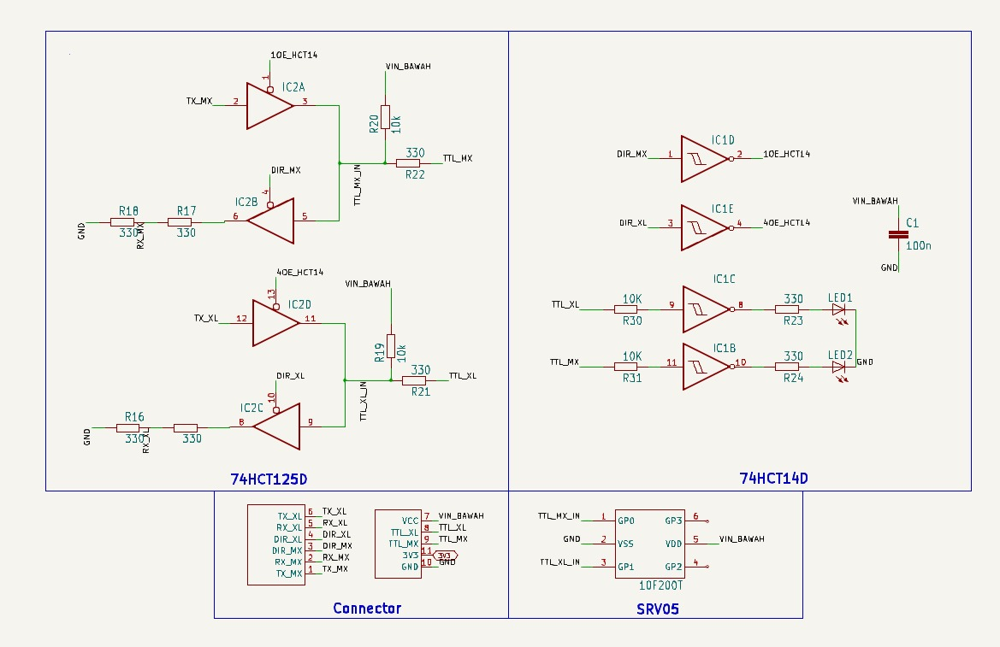

# Dokumentasi Transceiver
Folder ini berisi semua file hardware untuk proyek **Transceiver Board**. Design dibuat menggunakan [KiCad](https://kicad.org/) dan [Eagle](https://www.autodesk.com/products/eagle). Folder ini juga dilengkapi file produksi serta dokumentasi visual.

## 📃 Schematic
Berikut adalah schematic dari Transceiver Board 2.0. 

